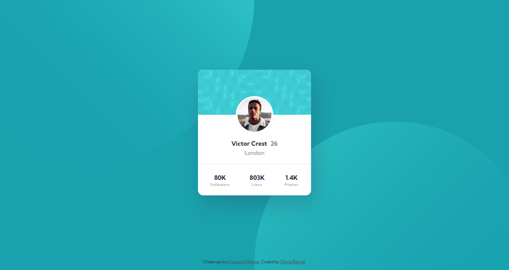
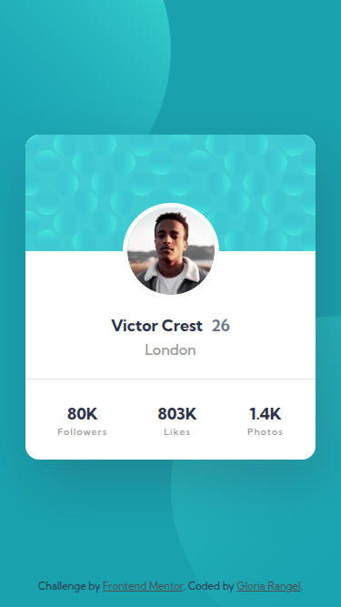

# 🖼 Frontend Mentor - Profile card component solution

This is a solution to the [Profile card component challenge on Frontend Mentor](https://www.frontendmentor.io/challenges/profile-card-component-cfArpWshJ). Frontend Mentor challenges help you improve your coding skills by building realistic projects. 

##  📋 Table of contents

-  Overview

-  Screenshot

-  Links

-  My process

-  Built with

- What I learned

-  Author

-  Thanks

##  📖 Overview

This challenge is a great opportunity to test and refine your layout skills, especially if you're still getting comfortable with **responsive design**. The task involves building a profile card component that doesn't shift or change, which makes it a good fit for those who are newer to working with responsive websites. The goal is to replicate the design of the profile card as closely as possible.

For this project, I used **SCSS** to manage the styles, making it easier to maintain and customize the design. While the challenge itself doesn't require any specific tools, I chose SCSS to help streamline the styling process and improve the overall structure of the CSS.

###  📸 Screenshot

These are the screenshots of the implemented solution:

-  **🖥️ Desktop version**

-  **📱 Mobile version**

###  ⛓️ Links

-  HTML URL: [index.html](https://github.com/NorimNori/profile-card-component/blob/main/index.html)

-  Styles URL: [styles folder](https://github.com/NorimNori/profile-card-component/tree/main/styles)

-  Live Site URL: [on Netlify](https://profile-card-component-by-gr.netlify.app/)

##  📌 My process

###  🪚 Built with

-  Semantic HTML5 markup

-  SCSS styles

-  Flexbox

-  CSS Grid

-  Mobile-first workflow

-  BEM class naming 

-  Local .ttf font for typography, loaded via @font-face.

###  🔬 What I learned

In this project, I mainly focused on working with `background-image` and adding responsive backgrounds. While I have made progress, I still have more to learn about this aspect of design. It's an area I’m eager to continue developing, and I plan to improve this part of the project in the near future as I refine my understanding of responsive background handling and performance optimization.

##  👋 Author

-  LinkedIn - [Gloria Rangel](https://www.linkedin.com/in/gloria-rangel-06b960306/)

-  Frontend Mentor - [@NorimNori](https://www.frontendmentor.io/profile/NorimNori)

##  🌟 Thank You 🌟

Thanks for visiting this repository! I hope you found it useful and inspiring, or it was just a fun time.

A special thanks to [Frontend Mentor](https://www.frontendmentor.io) for the challenge and for being such an amazing platform to learn and grow as a developer.

Have a nice day! 😊
